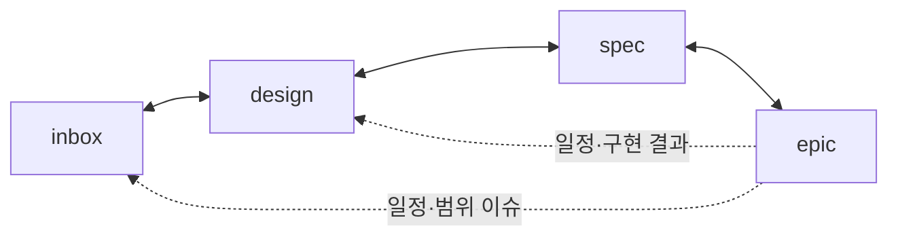

# Voxelcaster 문서 운영 규칙

이 문서는 `docs/` 안의 문서를 어떻게 만들고, 어떻게 서로 맞추는지 정한 규칙이다. 문서를 추가하거나 고치기 전에 먼저 읽는다.

## 1. 폴더 구조와 역할

```
docs/
├─ README.md      ← 이 문서 (운영 규칙)
├─ PROGRESS.md    ← 진행상황 공유 문서
├─ inbox/         ← 내가 생각한 러프한 기획, 아이디어
├─ design/        ← 상세 기획서 (무엇을 만드는가)
├─ spec/          ← 구현 명세 (어떻게 만드는가)
└─ epic/          ← 내가 할 일 (언제 무엇을 하는가)
```

| 폴더 | 한 줄 정의 | 작성 주체 | 답하는 질문 |
| --- | --- | --- | --- |
| inbox | 러프한 원본 아이디어 | 내가 직접 | "무엇을 하고 싶은가?" |
| design | inbox를 주제별로 쪼개 상세화한 기획서 | Claude 초안 → 내가 검토 | "게임이 어떻게 동작하는가?" |
| spec | design을 보고 구현 단위로 나눈 명세 | Claude 초안 → 내가 검토 | "코드/에셋으로 무엇을 만드는가?" |
| epic | 내가 해야 할 일 (캘린더식 할 일) | Claude 초안 → 내가 확정 | "오늘·이번 주에 무엇을 하는가?" |

### inbox
- 형식과 완성도에 제한이 없다. 문장 한 줄이어도 된다.
- 원본이므로 Claude는 **내용을 임의로 고치지 않는다.** 모순이나 빈틈이 보이면 inbox 문서 끝의 `미결 사항`에 질문으로 추가하거나 나에게 묻는다.

### design
- inbox 기획서를 **주제별로 파일 하나씩** 나눠 상세하게 쓴다. 한 파일은 한 주제만 다룬다.
- 예시 (필요한 만큼 추가한다):
  - `character.md` (플레이어), `skills.md`, `modifiers.md`, `enemies.md`, `ai.md`
  - `game-rules.md` (승패, 체력, 회복), `waves.md`, `controls.md`
  - `ui-*.md` (화면별), `data-schema.md`, `content-*.md` (콘텐츠 단위)
- "이 기획서만 읽고 다른 사람이 만들 수 있을 정도"로 구체적으로 쓴다: 수치, 예외 상황, 조합 규칙, 엣지 케이스를 포함한다.
- 수치는 1차 초안이면 `(초안)`으로 표시한다.

### spec
- design 문서를 보고 **구현해야 하는 것을 작은 단위로** 나눈다. 코드 구조, 클래스, 데이터 테이블, 에셋, 입력 매핑, 디버그 명령 등이 대상이다.
- 각 spec은 어느 design 문서를 근거로 하는지 반드시 적는다.
- 각 spec에는 **완료 조건**(무엇이 되면 끝인가)을 적는다. 검증 가능한 문장이어야 한다.

### epic
- 내가 할 일을 정하는 곳이다. 캘린더 할 일처럼 **날짜와 순서**가 있다.
- epic은 하나 이상의 spec을 묶고, spec의 완료 조건을 그날의 완료 기준으로 쓴다.
- 일정은 inbox의 개발 일정을 출발점으로 삼되, 다른 문서가 바뀌면 함께 조정한다.

## 2. 문서 공통 형식

모든 문서는 맨 위에 아래 메타 정보를 둔다.

```markdown
---
id: DES-SKILL-001        # 문서 ID (폴더별 접두어 + 주제 + 번호)
status: draft            # draft | review | confirmed | outdated
updated: 2026-09-25
source: [INB-001]        # 근거 문서 ID (inbox는 생략)
---
```

- ID 접두어: `INB`(inbox), `DES`(design), `SPC`(spec), `EPC`(epic)
- status 의미
  - `draft`: Claude가 쓴 초안, 아직 내가 보지 않음
  - `review`: 내가 검토 중이거나 수정 요청이 있음
  - `confirmed`: 내가 확정함
  - `outdated`: 상위 문서가 바뀌어 다시 맞춰야 함
- 파일명은 영문 소문자와 하이픈(`kebab-case`)으로 쓴다. 예외로 inbox 원본은 자유롭게 짓는다.
- 문서 안에서 다른 문서를 가리킬 때는 ID와 상대 경로 링크를 함께 쓴다. 예: `[DES-SKILL-001](../design/skills.md)`
- 문서 끝에는 `변경 이력` 표를 둔다 (날짜, 변경 내용, 사유).

## 3. 동기화 루프 (핵심 규칙)

문서는 위에서 아래로만 흐르지 않는다. **어느 문서가 바뀌어도 나머지 문서를 검토해서 고쳐야 할 곳을 고친다.**



### 3.1 트리거

| 일어난 일 | 해야 할 일 |
| --- | --- |
| inbox에 아이디어 추가·수정 | 영향받는 design 확인 → design 추가·수정 → spec → epic 순으로 검토 |
| design 추가·수정 | inbox와 모순 없는지 확인 → 관련 spec 수정 → epic 일정 조정 |
| spec 추가·수정 | 근거 design과 어긋나지 않는지 확인 → epic 작업량 재산정 |
| epic 변경 (일정 지연, 범위 축소) | 영향받는 spec·design·inbox 확인, 필요하면 범위 밖 항목을 갱신 |
| 구현 중 문제 발견 (수치 조정 등) | 해당 design부터 고치고 spec·epic으로 전파 |

### 3.2 검토 절차

1. **변경 문서 파악**: 무엇이 바뀌었는지 한 줄로 정리한다.
2. **인접 문서 대조**: 위·아래 폴더에서 같은 ID나 같은 주제를 찾아 내용이 맞는지 확인한다.
3. **모순·누락 처리**
   - 명백한 반영 누락 → 수정한다.
   - 어느 쪽이 맞는지 판단이 필요한 모순 → **나에게 묻는다.** 임의로 정하지 않는다.
4. **전파**: 수정한 문서의 상태를 `review`로, 그 문서에 의존하는 문서를 `outdated`로 표시한 뒤 같은 절차를 다시 돌린다.
5. **종료 조건**: 더 이상 모순이 없으면 루프를 끝내고 `PROGRESS.md`에 기록한다.
6. **변경 이력**: 고친 모든 문서의 변경 이력에 한 줄씩 남긴다.

### 3.3 우선순위와 충돌 해결

- 내용의 기준은 **inbox → design → spec** 순으로 위가 우선이다. 아래 문서가 위 문서와 다르면 아래를 고친다.
- 단, 구현 과정에서 위 문서가 현실과 맞지 않는다고 드러나면 위 문서 수정을 **제안**하고 내 확인을 받은 뒤 고친다.
- epic은 내용이 아니라 **일정**의 기준이다. 일정이 빠듯하면 내용을 줄이는 게 아니라, 줄일 후보를 나에게 제안한다.

## 4. 진행상황 문서 (`PROGRESS.md`)

내가 한눈에 현재 상태를 볼 수 있는 문서다. 다음을 포함한다.

- **오늘 요약**: 오늘 한 일, 지금 하는 일, 막힌 일
- **epic 진행표**: epic별 상태(예정 / 진행 중 / 완료 / 보류)와 완료율
- **문서 현황표**: 문서별 id, status, 마지막 수정일
- **동기화 대기 목록**: `outdated`이거나 나의 결정을 기다리는 항목
- **결정 필요 사항**: 내가 답해야 하는 질문 (미결 사항 모음)
- **최근 변경 로그**: 최근 변경 10건 이내 (날짜, 문서, 요약)

갱신 시점은 다음과 같다.
- 동기화 루프가 한 번 끝날 때마다
- epic 항목이 완료되거나 상태가 바뀔 때
- 하루 작업을 마칠 때

## 5. 작업 원칙

- **한 번에 한 주제**: 문서 하나가 여러 주제를 섞지 않는다. 커지면 쪼갠다.
- **중복 금지**: 같은 수치·규칙을 여러 문서에 복사하지 않는다. 한 곳에 쓰고 나머지는 링크한다. 수치의 원본은 design이다.
- **추측 금지**: inbox에 없는 내용을 새로 만들어야 할 때는 `(제안)`으로 표시하고 나의 확인을 받는다.
- **범위 유지**: inbox의 `범위 밖` 항목은 design/spec/epic에 넣지 않는다.
- **작게 자주**: 큰 문서 하나를 한 번에 쓰기보다, 작은 문서를 자주 동기화한다.

## 6. 변경 이력

| 날짜 | 변경 내용 | 사유 |
| --- | --- | --- |
| 2026-09-25 | 최초 작성 | 문서 체계(inbox/design/spec/epic)와 동기화 규칙 정의 |
