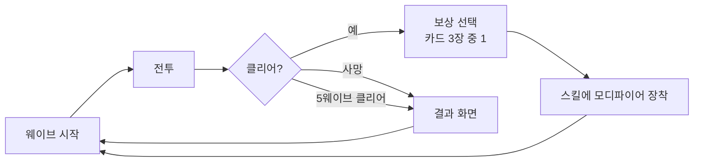

# Voxelcaster (가칭) 게임 기획서

Sep 25, 2026 · @통신ax개발팀

## 개요

기본 스킬 3개에 웨이브마다 모디파이어(관통·분열·폭발·연쇄·가속)를 붙여 빌드가 갈리는 탑다운 로그라이크 액션이다. 4일 안에 "선택이 조합되어 플레이가 달라진다"를 영상으로 보여주는 것이 목표다.

| 항목 | 내용 |
| --- | --- |
| 장르 | 탑다운 로그라이크 핵앤슬래시 (웨이브 서바이벌) |
| 엔진 | Unreal Engine 5, C++ |
| 플랫폼 | PC (Windows), 키보드·마우스 + 게임패드 |
| 아트 | 복셀 스타일, 무료 에셋·기본 도형 |
| 개발 기간 | 4일 (추석 연휴) |
| 목적 | 포트폴리오: UMG/CommonUI + MVVM UI, 게임패드 UI 조작, 스킬 시스템 설계 시연 |

- 이미 만든 경량 스킬 시스템(DreamScape, Cooldown 포함)을 재사용해 1\~2일차를 줄이고, 남는 시간을 UI에 쓴다.
- 참고작의 고유 기믹(예: 시간 정지)은 가져오지 않는다.

## 핵심 게임 루프

한 판은 5웨이브, 약 8\~10분이다. 웨이브를 클리어할 때마다 모디파이어 3장 중 1장을 골라 스킬에 붙인다.



보상 선택 중에는 게임이 일시정지된다. 결과 화면에는 이번 판의 최종 빌드(스킬별 모디파이어)를 보여준다.

## 조작

모든 조작은 키보드·마우스와 게임패드 양쪽으로 가능해야 한다. 마지막으로 입력한 장치에 따라 버튼 아이콘과 커서 표시가 즉시 바뀐다.

| 입력 액션 | 키보드·마우스 | 게임패드 (Xbox) |
| --- | --- | --- |
| 이동 | WASD | 왼쪽 스틱 |
| 조준 | 마우스 위치 | 오른쪽 스틱 (미입력 시 이동 방향) |
| 스킬 1 | 마우스 왼쪽 | RT |
| 스킬 2 | 마우스 오른쪽 | LT |
| 스킬 3 | Q | RB |
| 대시 | Space | A |
| UI 확인 | Enter / 클릭 | A |
| UI 이동 | 방향키 / 마우스 | 왼쪽 스틱 / D패드 |
| 일시정지 | Esc | Menu |

게임플레이 입력은 Enhanced Input으로, UI 입력은 CommonUI(Enhanced Input 지원 켬)로 처리한다.

## 스킬

기본 스킬은 3종이며, 형태(투사체·범위·근접)를 다르게 해 같은 모디파이어도 스킬마다 다르게 보이게 한다. 수치는 모두 1차 초안이다.

| 스킬 | 형태 | 피해 | 쿨다운 | 비고 |
| --- | --- | --- | --- | --- |
| 매직 볼트 | 직선 투사체, 1발 | 20 | 0.4초 | 주력 평타 |
| 노바 | 자신 주변 원형 범위 (반경 3m) | 35 | 4초 | 포위 탈출용 |
| 블레이드 스윕 | 전방 120° 부채꼴 근접 (반경 2.5m) | 30 | 1.5초 | 근접 견제 |

- 각 스킬은 모디파이어 슬롯 3칸을 가진다. 같은 모디파이어를 중복 장착하면 효과가 강화된다(스택).
- 대시는 스킬 시스템 밖의 이동 기능으로, 쿨다운 1초·무적 0.2초만 가진다.

## 모디파이어

모디파이어는 5종이며, 스킬 코드를 고치지 않고 "피격 시·발사 시" 같은 훅에 붙는 방식으로 구현한다. 같은 모디파이어도 스킬 형태에 따라 결과가 달라지는 것이 빌드의 재미다.

| 모디파이어 | 효과 (1스택) | 스택당 강화 | 매직 볼트 | 노바 | 블레이드 스윕 |
| --- | --- | --- | --- | --- | --- |
| 관통 | 적 1명 관통 | +1명 | 일렬 적 관통 | 효과 없음 → 보상 풀에서 제외 | 효과 없음 → 제외 |
| 분열 | 명중 시 작은 투사체 2발 | +1발 | 명중 지점에서 분열 | 적마다 투사체 방출 | 적마다 투사체 방출 |
| 폭발 | 명중 지점 반경 1.5m 폭발 (피해 50%) | 반경 +0.5m | 명중 시 폭발 | 적마다 폭발 | 적마다 폭발 |
| 연쇄 | 가까운 적 1명에게 번개 전이 (피해 70%) | +1회 | 명중 후 전이 | 적마다 전이 | 적마다 전이 |
| 가속 | 쿨다운 -15% | -15% (최대 3스택) | 연사 증가 | 자주 사용 | 자주 사용 |

**조합 규칙**

- 파생 효과(분열 투사체, 폭발, 연쇄 번개)는 다른 모디파이어를 다시 발동하지 않는다. 무한 연쇄를 막기 위한 규칙이다.
- 보상 카드 3장은 서로 다른 (스킬, 모디파이어) 조합으로 뽑고, 효과 없는 조합과 슬롯이 가득 찬 스킬은 제외한다.
- 카드에는 "매직 볼트 + 폭발 (2스택)"처럼 대상 스킬과 장착 후 스택 수를 표시한다.

## 적과 웨이브

적은 2종, 웨이브는 5개다. 스폰은 기존 ACSpawnManager 구조를 재사용하고, 마지막 웨이브에만 엘리트 1마리를 넣는다.

| 적 | 체력 | 이동 속도 | 행동 |
| --- | --- | --- | --- |
| 러너 | 40 | 빠름 | 플레이어에게 돌진, 접촉 피해 10 |
| 슈터 | 60 | 느림 | 거리 6m 유지, 1.5초마다 투사체 (피해 8) |
| 엘리트 (슈터 강화) | 400 | 느림 | 3방향 투사체, 체력 50%에서 러너 4마리 소환 |

| 웨이브 | 구성 | 목표 시간 |
| --- | --- | --- |
| 1 | 러너 12 | 60초 |
| 2 | 러너 16 + 슈터 4 | 80초 |
| 3 | 러너 20 + 슈터 8 | 100초 |
| 4 | 러너 28 + 슈터 12 | 120초 |
| 5 | 러너 30 + 슈터 10 + 엘리트 1 | 150초 |

플레이어 체력은 100이며, 웨이브를 클리어하면 30 회복한다.

## UI

UI는 CommonUI + MVVM으로 만들고, 마우스 없이 게임패드만으로 처음부터 끝까지 플레이할 수 있어야 한다. 가장 공을 들이는 화면은 보상 선택이다.

| 화면 | 레이어 | 입력 모드 | 내용 |
| --- | --- | --- | --- |
| HUD | Game | Game | 체력, 웨이브 번호·남은 적 수, 스킬 3칸(쿨다운·장착 모디파이어 아이콘), 입력 장치별 버튼 아이콘 |
| 보상 선택 | Menu | Menu | 카드 3장(스킬 + 모디파이어 + 스택 수), 현재 빌드 요약, 확인 버튼 안내 |
| 일시정지 | Menu | Menu | 재개, 재시작, 종료 |
| 결과 | Menu | Menu | 도달 웨이브, 처치 수, 최종 빌드, 재시작 |

**보상 선택 화면 요구사항**

1. 열리면 가운데 카드에 포커스가 잡힌다. 좌우 입력으로 카드를 이동한다.
2. 포커스된 카드는 확대·테두리 강조되고, 해당 스킬의 현재 모디파이어 목록이 하단에 표시된다.
3. 뒤로가기로 닫을 수 없다. 반드시 1장을 골라야 한다.
4. 확인 후 0.3초 연출 뒤 화면이 닫히고 게임이 재개된다.

**클래스 구조**

- View: `UW_PrimaryLayout`(레이어 스택), `UW_UpgradeSelect`(CommonActivatableWidget), `UW_UpgradeCard`(CommonButtonBase), `UW_HUD`
- ViewModel: `UUpgradeSelectVM`(카드 VM 3개, 선택 인덱스), `UUpgradeCardVM`(이름, 설명, 아이콘, 스택), `UHudVM`(체력, 웨이브, 스킬 슬롯)
- Logic: `UUpgradeSubsystem`(후보 추첨, 장착 적용, `OnChoicesReady` 델리게이트). UI를 참조하지 않는다.
- 디버그: CheatManager `ShowUpgradeSelect`, `GiveModifier <스킬> <모디파이어>` 콘솔 명령

## 데이터 구조

스킬·모디파이어·웨이브는 모두 데이터로 정의하고, 수치 조정은 코드 수정 없이 한다. 아래 JSON이 Refinery 파이프라인의 스키마 초안이며, UE에서는 각각 DataTable 행 구조체로 대응한다.

```json
{
  "skills": [
    {
      "id": "MagicBolt",
      "displayName": "매직 볼트",
      "shape": "Projectile",
      "damage": 20,
      "cooldown": 0.4,
      "modifierSlots": 3
    }
  ],
  "modifiers": [
    {
      "id": "Explode",
      "displayName": "폭발",
      "trigger": "OnHit",
      "base": { "radius": 1.5, "damageRatio": 0.5 },
      "perStack": { "radius": 0.5 },
      "maxStack": 3,
      "excludedShapes": []
    }
  ],
  "waves": [
    {
      "index": 1,
      "spawns": [ { "enemyId": "Runner", "count": 12 } ],
      "targetDuration": 60
    }
  ]
}
```

| 구조체 | 주요 필드 | 비고 |
| --- | --- | --- |
| `FSkillRow` | Id, Shape, Damage, Cooldown, ModifierSlots | Shape: Projectile / Area / Melee |
| `FModifierRow` | Id, Trigger, Base, PerStack, MaxStack, ExcludedShapes | Trigger: OnCast / OnHit / Passive |
| `FWaveRow` | Index, Spawns\[\], TargetDuration | 적 정의는 `FEnemyRow`로 분리 |

런타임 상태(스킬별 장착 모디파이어와 스택)는 데이터 테이블과 분리해 `UUpgradeSubsystem`가 관리한다.

## 4일 개발 일정

매일 끝에 플레이 가능한 빌드가 있어야 한다. 3일차까지 끝나면 영상은 찍을 수 있는 상태가 목표다.

| 일차 | 목표 | 완료 기준 |
| --- | --- | --- |
| 1일차 | 캐릭터 이동·대시, 스킬 3종(기존 스킬 시스템 이식), 러너 스폰 | 패드와 키보드로 러너를 잡을 수 있다 |
| 2일차 | 모디파이어 5종, 슈터·웨이브 5개, 데이터 테이블 | 콘솔 명령으로 모디파이어를 붙이면 스킬이 바뀐다 |
| 3일차 | 보상 선택 화면, HUD, 입력 장치 아이콘 전환 | 마우스 없이 1판을 끝까지 플레이할 수 있다 |
| 4일차 | 엘리트, 결과 화면, 타격감(진동·히트스톱), 버그 수정, 영상·블로그 | 1분 플레이 영상 |

**범위 밖 (하지 않는 것)**

- 메타 성장, 저장, 여러 캐릭터, 사운드 디자인
- 모디파이어 7종 이상, 여러 맵
- 참고작의 고유 기믹

## 미결 사항

- [ ] 게임 이름 확정 (후보: Voxelcaster, Bitmancer, Modify or Die) 및 Steam 동명 게임 확인
- [ ] DreamScape 스킬 시스템이 싱글플레이에서 복제(FastArraySerializer) 없이 동작하도록 정리할지
- [ ] 복셀 에셋 출처 (마켓플레이스 무료 에셋 / 기본 도형)
- [ ] 스킬·적 수치는 1일차 플레이 후 재조정
